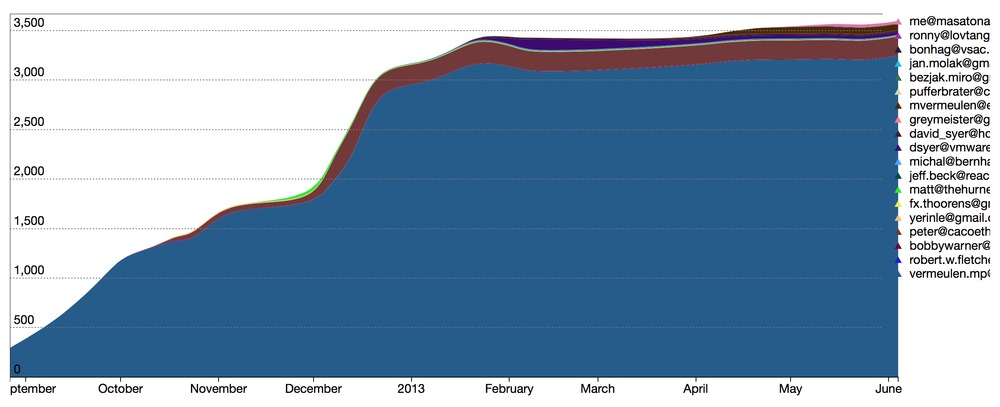

# Gather stats from Git repository and visualize using d3js

Render from https://github.com/sdkman/sdkman-cli

## Usage
  `ruby gitown.rb config.json`  
  open `index.html`  

## TODO
  [ ]. add threshold line http://bl.ocks.org/mikehadlow/93b471e569e31af07cd3
  [ ]. publish ruby gem http://guides.rubygems.org/publishing/
  [ ]. normalize email, at least to lower case
  [ ]. total time
  [ ]. highlight inactive users
  [ ]. stratigraphy by folders
  [ ]. reorder items according to first appearance in the code

